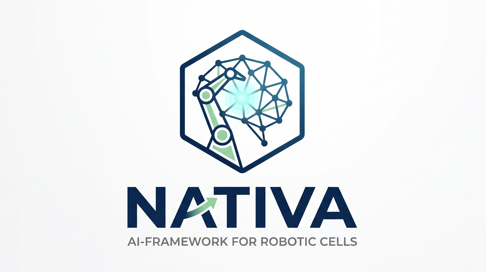

[](LICENSE)

# NativaGPT

**Description:** NativaGPT is a Python backend that gives a robotic cell (or any system exposing sensors/commands) a conversational, tool-using assistant on top of any LLM. It talks to the model over a generic, OpenAI-compatible Chat Completions API, and uses the [Model Context Protocol](https://modelcontextprotocol.io/) (MCP) to let the LLM call real tools - shell/ROS commands, MCP-server-provided functions, and retrieval over a local knowledge base - then feeds the results back to the model for a natural-language reply.

- **What it does** — runs a text-based conversation loop (interactively or over a REST API) that sends the user's message plus retrieved context to an LLM, executes any tool/command the LLM asks for (via a local command-execution engine or MCP tool calls), and returns the LLM's follow-up response.
- **Who it is for** — robotics researchers/engineers and hobbyists who want to bolt a natural-language, tool-calling assistant onto a ROS-based (or general Linux) system without committing to a specific LLM provider.
- **The problem it solves** — most "chat with your robot" setups hardcode a single proprietary LLM API and mix prompt-building, tool-execution, and API-client code together. NativaGPT keeps the LLM client generic (swap providers via config, not code) and keeps tool execution, retrieval, and conversation orchestration as separate, reusable pieces.

**Screenshot:**

<!-- TODO: add a screenshot/terminal recording of a NativaGPT conversation here. -->

---

## 1. Project status

This project is currently **in progress**: it is actively being developed. The core LLM + MCP tool-calling chat loop and the REST API work end-to-end; voice I/O (speech-to-text/text-to-speech) has been intentionally removed to keep the project focused on text/API interaction (see [Known issues](#7-known-issues)).

---

## 2. Technology stack

- **Language:** Python ≥ 3.10, < 3.13
- **Frameworks and libraries:** Flask/Flask-Cors (REST API), the official [MCP SDK](https://modelcontextprotocol.io/) (tool-calling client/servers), `requests` (LLM API client), `python-dotenv` (API key loading), `ollama` (local embeddings for retrieval), `transformers`/`torch` (a standalone translation utility script), OpenCV/Pillow (image handling for vision prompts and camera topics), `pyautogui`/`pynput` (desktop-automation tools exposed to the LLM), `paho-mqtt` (MQTT topic reading)
- **Other tools:** pip/hatchling packaging, GitHub Actions (CI), `pytest`/`ruff`/`black` (dev tooling)

NativaGPT is a plain pip package, not a ROS package - it runs standalone in any Python environment. ROS1 integration (reading topics, executing `rostopic` commands) is entirely optional: `rospy`/`rostopic`/`cv_bridge` are imported behind `try`/`except` guards and the assistant runs fine without ROS installed, just with ROS-dependent tools unavailable.

It is composed of two subsystems:

- **`NativaGPT.lib`** — the core library: `LLMPromptHandler` (the OpenAI-compatible LLM client), `LLMResponseHandler`/`JsonResponseHandler` (parsing LLM replies into text + tool calls), `CommandExecution` (shell/ROS command execution engine), `RAGSimilarityCheck` (embedding-based retrieval over a tool/knowledge database), `ConfigManager`, and `lib/mcp/` (the MCP client plus example/generic MCP servers).
- **`NativaGPT.scripts`** — the runnable entry points: `nativa.py` (the interactive text assistant), `nativa_restAPI.py` (a Flask REST API over the same assistant), `nativa_mcp_wrapper.py` (a simplified synchronous wrapper with conversation memory), and `start_nativa.py` (a launcher that brings up a local LLM backend then starts the assistant).

See [Architecture diagrams](#6-architecture-diagrams) for how these pieces fit together end-to-end.

---

## 3. Dependencies

### Python (pip-installable, declared in `pyproject.toml`)

| Package | Used for |
|---|---|
| `requests` | HTTP client - talks to the configured LLM API and does local port/health checks |
| `flask`, `Flask-Cors` | The REST API (`nativa_restAPI.py`) |
| `mcp` | Official MCP SDK - the tool-calling client and example MCP servers |
| `python-dotenv` | Loads the LLM API key from a local `.env` file |
| `ollama` | Local embedding model client used by `RAGSimilarityCheck` for retrieval |
| `torch`, `transformers` | Model loading/inference for the standalone `text_translator.py` utility script |
| `opencv-python`, `Pillow` | Image handling - vision-model prompt attachments and ROS/MQTT camera topic decoding |
| `pyautogui`, `pynput` | Desktop-automation "tools" exposed to the LLM (mouse/keyboard control) |
| `paho-mqtt` | MQTT client for reading MQTT-based "topics" as LLM context |
| `qdrant-client`, `bytez`, `ffmpeg`, `path`, `packaging`, `python-dateutil` | Supporting utility libraries used by parts of the codebase (JSON/date handling, media/version utilities) |

### System / ROS (not pip-installable, entirely optional)

| Package | Used for |
|---|---|
| `rospy`, `rostopic` | ROS1 Python client library - topic reading, command execution. Guarded by `try`/`except`; absent = those tools are simply unavailable. |
| `cv_bridge` | ROS `Image` message ⇄ OpenCV array conversion for camera topics |

### Dev-only (`pip install pytest ruff black`, or `[dependency-groups].dev`)

| Package | Used for |
|---|---|
| `pytest` | Runs the smoke tests under `tests/` |
| `ruff` | Linting |
| `black` | Formatting |

Keep dependencies up to date to avoid security vulnerabilities and compatibility issues (see `pyproject.toml` and `CHANGELOG.md` for the currently pinned versions).

---

## 4. Installation

```bash
# 1. System packages
sudo apt install -y python3-dev python3-venv

# 2. Clone
git clone https://github.com/pascd/NativaGPT.git
cd NativaGPT

# 3. Create a Python environment and install the package
python3 -m venv venv
source venv/bin/activate
pip install -e .

# 4. Set up a local LLM backend (zero-cost default: Ollama)
curl -fsSL https://ollama.com/install.sh | sh
./NativaGPT/bash/launch_llm_ollama.sh

# 5. Copy the environment template (only needed if your LLM endpoint requires an API key)
cp .env.example .env
```

This is a plain pip package - no `colcon build`/ROS workspace step is required, even when ROS-dependent tools are used (just have ROS1 sourced in the environment you run NativaGPT from).

To point at a cloud provider like OpenAI instead of local Ollama, see [`docs/CONFIGURATION.md`](docs/CONFIGURATION.md).

---

## 5. Usage

### Interactive text assistant

```bash
python3 NativaGPT/scripts/start_nativa.py
```

### REST API

```bash
python3 NativaGPT/scripts/nativa_restAPI.py
```

Exposes `/chat`, `/history`, `/tools`, `/status`, `/health` endpoints - see `NativaGPT/scripts/nativa_restAPI.py` for the full list.

### Package layout

```
NativaGPT/
├── lib/                 # core library
│   ├── handlers/        # LLM prompt/response handlers, command/JSON/topic parsing
│   ├── mcp/             # MCP client + example/generic MCP servers
│   ├── config_manager.py
│   ├── command_execution.py
│   └── rag_similarity_check.py
├── scripts/              # runnable entry points (nativa.py, nativa_restAPI.py, ...)
└── bash/                 # optional launcher scripts for local LLM backends
config/                    # config_default.json + tool/function JSON definitions
docs/                       # architecture and configuration reference
tests/                      # smoke tests
```

---

## 6. Architecture diagrams

The module map and the full request lifecycle - from user input, through the LLM, to tool execution and back - are diagrammed in:

- [`docs/ARCHITECTURE.md`](docs/ARCHITECTURE.md)

---

## 7. Known issues

- **No automated tests for MCP-server/ROS-dependent code paths.** CI only covers the dependency-installable subset (import check, config loading, LLM request building); changes touching `mcp_server_ros.py`, `cv_bridge`-dependent code in `topic_reader_handler.py`/`command_execution.py` must currently be validated manually against a real ROS1 environment.
- **Voice I/O (STT/TTS) has been removed.** NativaGPT was previously able to run in a microphone/speaker "voice mode"; this has been intentionally dropped to keep the project focused on text/API interaction. If you need voice I/O, integrate a separate STT/TTS service in front of the REST API.

---

## 8. License

NativaGPT is licensed under the **MIT License** - see [LICENSE](LICENSE) for the full text.

Copyright © 2025 Pedro Afonso Dias.

---

## 9. Documentation and resources

- [CHANGELOG.md](CHANGELOG.md) — release history and notable changes
- [CITATION.cff](CITATION.cff) — citation metadata; use this if you use NativaGPT in academic work
- [`docs/CONFIGURATION.md`](docs/CONFIGURATION.md) — field-by-field configuration reference, including how to switch LLM backends
- [`docs/ARCHITECTURE.md`](docs/ARCHITECTURE.md) — module map and request-lifecycle overview
- `config/config_default.json` and `config/functions/*.json` — reference config and tool-definition templates

---

## 10. Community standards and contribution

Please review these before contributing:

- [Code of Conduct](CODE_OF_CONDUCT.md)
- [Contributing Guidelines](CONTRIBUTING.md)
- [Security Report Template](docs/reporting_template.md)
- [Security Policy](SECURITY.md)

Contributions are welcome! See [CONTRIBUTING.md](CONTRIBUTING.md) for development setup, coding conventions, and the pull-request process. By participating, you agree to abide by the [Code of Conduct](CODE_OF_CONDUCT.md).

To report a security vulnerability, see [SECURITY.md](SECURITY.md) instead of opening a public issue.

---

## 11. Credits and acknowledgements

- Pedro Afonso Dias – Developer

---

## 12. Contacts

For support or inquiries, please open a GitHub issue on this repository.
